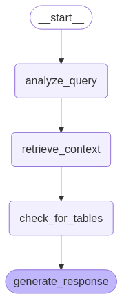

# Multi-Step Query Agentic RAG System

This project implements an advanced RAG (Retrieval-Augmented Generation) system using LangGraph for orchestrating a multi-step query process. The system is specifically designed to handle complex queries about port tariffs and fees, with special handling for table references and context-aware responses.

## Project Structure

```
.
├── README.md
├── config.py                 # Configuration settings and environment variables
├── ingest_docs.py           # Document ingestion and chunking logic
├── vector_store.py          # FAISS vector store management
├── document_processor.py    # Document and table reference processing
├── agents.py               # Main agent implementation using LangGraph
├── main.py                 # Entry point for running the application
└── requirements.txt        # Project dependencies
```

## Components Overview

### 1. Agent Workflow
The system uses a LangGraph-based workflow with the following steps:

1. **analyze_query**: Uses LLM to analyze the user's question and identify tariff-related terms
2. **retrieve_context**: Retrieves relevant context from the vector store
3. **check_for_tables**: Identifies and retrieves additional context from related tables
4. **generate_response**: Generates the final response using all gathered context



### 2. Vector Store (vector_store.py)
- Manages the FAISS vector store for semantic search
- Handles document storage and retrieval
- Uses Azure OpenAI embeddings for vector representations

### 3. Document Processor (document_processor.py)
- Processes documents and identifies table references
- Handles table extraction and linking
- Manages document chunking and preprocessing

### 4. Configuration (config.py)
- Manages Azure OpenAI API configurations
- Sets up environment variables and paths
- Configures logging and system parameters

## Setup and Installation

1. **Create a virtual environment**:
```bash
uv venv my_env
source my_env/bin/activate  # On Unix/macOS
my_env\Scripts\activate     # On Windows
```

2. **Install dependencies**:
```bash
uv pip install -r requirements.txt
```

3. **Configure environment variables**:
Create a `.env` file with your Azure OpenAI credentials:
```env
AZURE_OPENAI_API_KEY=your_api_key
AZURE_OPENAI_ENDPOINT=your_endpoint
AZURE_OPENAI_API_VERSION=2024-12-01-preview
AZURE_OPENAI_EMBEDDING_DEPLOYMENT=your_embedding_model
AZURE_OPENAI_CHAT_DEPLOYMENT=your_chat_model
```

## Usage

1. **Ingest Documents**:
First, ingest your documents to create the vector store:
```bash
uv run python ingest_docs.py
```

2. **Run the Application**:
There are two ways to run the application:

a. Interactive Mode:
```bash
uv run python main.py
```

b. Single Question Mode:
```bash
uv run python main.py --question "What are the current anchorage dues rates?"
```

## How It Works

1. **Document Ingestion**:
   - Documents are chunked and processed
   - Each chunk is embedded using Azure OpenAI
   - Embeddings are stored in a FAISS vector store

2. **Query Processing**:
   - User query is analyzed for tariff-related terms
   - Relevant context is retrieved from the vector store
   - Table references are identified and additional context is gathered
   - Final response is generated using all available context

3. **Table Handling**:
   - System identifies references to tables in the text
   - Related table content is retrieved and added to the context
   - Ensures comprehensive responses including tabular data

## Debugging

- Check `temp_context.txt` to see what context is being used for responses
- View `graph.png` for a visualization of the agent workflow
- Enable debug logging for more detailed information

## Notes

- The system uses Azure OpenAI's O3 model for improved reasoning capabilities
- Context size is managed to optimize token usage
- Table references are handled intelligently to provide comprehensive answers

## Requirements

- Python 3.8+
- Azure OpenAI API access
- FAISS for vector storage
- LangGraph for workflow management
- See `requirements.txt` for complete list

## Future Improvements

1. Enhanced table detection and processing
2. Better query refinement strategies
3. Improved context relevance scoring
4. Support for more document formats
5. Integration with additional data sources
